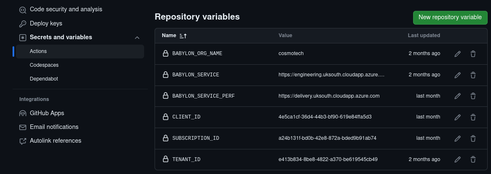
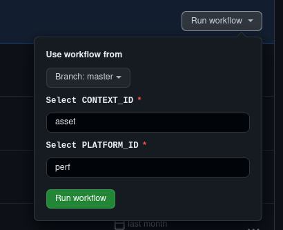

# Brewery-Azure-Deployment

> References

- [`https://cosmo-tech.github.io/Babylon-End-User-Doc/3.1.0/guides/`](https://cosmo-tech.github.io/Babylon-End-User-Doc/3.1.0/guides/)

- [`https://github.com/Cosmo-Tech/babylon-actions`](https://github.com/Cosmo-Tech/babylon-actions/blob/brewery/README.md)

## Introduction

This repository is the base repository that contains the template workflows and necessary files for deploying the brewery solution on Azure. These include:

- File 1: brewery.yaml
- File 2: solution.yaml
- File 3: dataset.yaml
### Project Tree
---
This is how the project is structured :
```bash
.
├── config
│   ├── dev
│   │   ├── dataset.yaml
│   │   └── solution.yaml
│   ├── perf
│   │   ├── dataset.yaml
│   │   └── solution.yaml
│   └── staging
├── .github
│   └── workflows
│       └── brewery.yml
├── LICENSE.md
└── README.md
```
## About Files 

- `brewery.yml file`: The required file for deploying brewery. It contains all the necessary actions for deploying the solution. From this file, calls are made to actions that are developed in the [`https://github.com/Cosmo-Tech/babylon-action@brewery`](https://github.com/Cosmo-Tech/babylon-actions/tree/brewery) repository. The actions depend on the solution (supply, brewery, brewery...).

- `solution.yaml`: This file contains the structure of our solution. It varies for each solution, and this file is valid only for brewery.

- `dataset.yaml` : This file is a template that is required for creating a storage dataset.
<br>
<span style="color: red;">Note</span> : If you need a `twin` dataset or `ADT`, you should modify the content of this file and replace it with the content of the `twin` or `ADT` dataset.

## Break down how this workflow works

### Preparing the Environment for Babylon
---
Export the necessary environment variables. These variables should be passed in the GitHub settings.


```bash
env:
  BABYLON_SERVICE: ${{ vars.BABYLON_SERVICE }}
  BABYLON_TOKEN: ${{ secrets.BABYLON_TOKEN }}
  BABYLON_ORG_NAME: ${{ vars.BABYLON_ORG_NAME }} 
  BABYLON_ENCODING_KEY: ${{ secrets.BABYLON_ENCODING_KEY_PERF }}
  GITHUB_PAT: ${{ secrets.PAT }}
```
>break down :

The vault service is required to work with babylon cli. Contact your babylon admin to get your URI service.
- `BABYLON_SERVICE` : [`https://engineering.uksouth.cloudapp.azure.com`](https://engineering.uksouth.cloudapp.azure.com)
- `BABYLON_TOKEN`: Contact the cloud team.
- `BABYLON_ORG_NAME`: cosmotech
- `BABYLON_ENCODING_KEY` : This is generated with the Babylon command, we will observe it later.
-  `GITHUB_PAT`: GitHub access token has already been generated, check the vault

### Trigger
---
This workflow is triggered both manually using `workflow_dispatch` and automatically on `push` or `pull_request` in the main branch.


```bash
  workflow_dispatch:
    inputs:
      context_id:
        description: 'Select CONTEXT_ID'
        required: true
        default: 'brewery'
        type: string
        enum:
          - 'brewery'
          - 'performance_mona-dev'
      platform_id:
        description: 'Select PLATFORM_ID'
        required: true
        default: 'dev'
        type: string
        enum:
          - 'dev'
          - 'perf'
          - 'staging'
  push:
    branches:
      - master
  pull_request:
    branches:
      - master 
```
### Steps
---
- 1 Install Babylon :

> Call Action

```bash
- name: 🛠 Install Babylon
  uses: Cosmo-Tech/babylon-actions/.github/actions/babylon@brewery
```
- 2 Setup Basic Configuration:

> Call Action

```bash
- name: ⚙️ Setup Basic Configuration
  uses: Cosmo-Tech/babylon-actions/.github/actions/set-variables@brewery
     with: 
        email: mohcine.tor@cosmotech.com
        user_principal_id: 67bf46cc-38ec-4f23-aba7-fedfcde26856
        workspace_key: PerfAsset
        team_id: 25d59980-4644-4ba0-af6f-2ce9fae86c96
        simulator_image_docker: simulator_simulator
        simulator_version: ASSET_v14.2.1_2023-10-26-15h23-27Z
        uri_artifact_zip: https://github.com/Cosmo-Tech/azure-function-scenario-download/releases/download/v1.0.1/artifact.zip
        deployment_name: AzureRTEPiloteDeliveryPerf
        location: westeurope
        repo_to: azure-webapp-brewery-qa
        branch_to: dev/brewery
        organization: Cosmo-Tech
        api_url: https://perf.api.cosmotech.com/v2 
        api : "true"
        item: "WP03_RunTemplate"
```
- `user_principal_id` : This is the User Object ID in Azure. In this case, I used my Object ID in your case, use yours.
- `workspace_key` : To be defined by the user
- `team_id` : This is the Azure Group ID of the team. In my case, I use the one from the Brewery team.
- `simulator_image_docker` : This is the repository of the simulator. In this case, it is <span style="color: red;">simulator_simulator</span>.
- `simulator_version` : simulator version in this case is <span style="color: red;">ASSET_v14.2.1_2023-10-26-15h23-27Z</span>

- `uri_artifact_zip` : This is the link to the archive that allows you to deploy version v1.0.1 of the Azure Function. 
for more information about this url chechk this like : [`https://cosmo-tech.atlassian.net/wiki/spaces/PRODUCTS/pages/19333132/Webapp`](https://cosmo-tech.atlassian.net/wiki/spaces/PRODUCTS/pages/19333132/Webapp+-+Instance+visualization+with+cytoscape#How-to-update-your-Function-App)
- `deployment_name` : This is the name taken by the application during deployment, chosen by the user.
- `repo_to` : This is the repository when you want to deploy the application.
- `branch_to` :  This is the branch in this repository.
- `api_url` : Here, you specify the version of the API you want because Babylon uses the latest version by default. In this case, I use version 2, and also set the <span style="color: red;">api filed</span> as true to activate this feature.
- `api` : "true"
---
- 3 Create a New Organization :

> Call Action

```bash
- name: 🏢 Create a New Organization
  uses: Cosmo-Tech/babylon-actions/.github/actions/organization@brewery
    with:
        name: "RTE"
        email: your.email@cosmotech.com
        role: admin
```
- 4 Create Container Storage by Default :

> Call Action

```bash
- name: 📦 Create Container Storage by Default
  uses: Cosmo-Tech/babylon-actions/.github/actions/storage@brewery
```
- 5 Deploy ADX Database and Permissions :

> Call Action

```bash
- name: 🚀 Deploy ADX Database and Permissions
  uses: Cosmo-Tech/babylon-actions/.github/actions/adx@brewery
```
- 6 Deploy Eventhub Namespaces and Permissions :

> Call Action

The `name` field is chosen by the user.
```bash
- name: 🚀 Deploy Eventhub Namespaces and Permissions
  uses: Cosmo-Tech/babylon-actions/.github/actions/eventhub@brewery
    with:
        name: "Asset_Eventhub_Deploy"
```
- 7 Azure Login :

> Call Action

This is the call to the action named `Azure/login@v1` for logging into Azure. It takes the following parameters:
- `CLIENT_ID` : 4e5ca1cf-36d4-44b3-bf90-619e84ffa5d3
- `CLIENT_SECRET` : This is the secret client ID
- `SUBSCRIPTION_ID` : a24b131f-bd0b-42e8-872a-bded9b91ab74
- `TENANT_ID` : e413b834-8be8-4822-a370-be619545cb49


```bash
- name: 🔐 Azure Login
  uses: Azure/login@v1
    with:
        creds: '{"clientId":"${{ vars.CLIENT_ID }}","clientSecret":"${{ secrets.CLIENT_SECRET }}","subscriptionId":"${{ vars.SUBSCRIPTION_ID }}","tenantId":"${{ vars.TENANT_ID }}"}'
```
- 8 Authentication Eventhub Configuration :

> Call Action

The `resource_group` field depends on the chosen platform, in this case, it is `perf`
```bash
- name: 🔐 Authentication Eventhub Configuration
  uses: Cosmo-Tech/babylon-actions/.github/actions/eventkey@brewery
     with:
        resource_group: phoenixperf
```
- 9 Generate Workspace Name :

> Run Action

This action is used to generate a randomized name for the Power BI dashboard and scenario to avoid conflicts in their names.
```bash
- name : 🔍 Generate Workspace Name
  id : GWN
  run : |
    WNDASH=$(date "+%Y-%m-%d_%H:%M:%S")_$(head /dev/urandom | tr -dc 'a-zA-Z0-9' | head -c 3)
    
    echo "WNDASH=$WNDASH" >> $GITHUB_OUTPUT
   
    WNSENA=$(date "+%Y-%m-%d_%H:%M:%S")_$(head /dev/urandom | tr -dc 'a-zA-Z0-9' | head -c 3)
    
    echo "WNSENA=$WNSENA" >> $GITHUB_OUTPUT
```
- 10 Deploy Workspace PowerBI  :

> Call Action

This call action takes as parameters the values generated in the previous action.
```bash
- name : 📊 Deploy Workspace PowerBI 
  uses : Cosmo-Tech/babylon-actions/.github/actions/powerbi@brewery
    with:
        workspace_name_dashboard: rte-pilote-delivery-perf_${{ steps.GWN.outputs.WNDASH }}
        
        workspace_name_scenario: rte-pilote-delivery-perf_${{ steps.GWN.outputs.WNSENA }}

```
- 11 Retrieve Sample WebApp :

> Call Action

```bash
- name: 📥 Retrieve Sample WebApp
  uses: Cosmo-Tech/babylon-actions/.github/actions/retrieve@brewery
    with:
        repo_from: Cosmo-Tech/webapp-brewery-demo
        branch_from: upstream/deployment/delivery-rte-performance
        repo_to: Cosmo-Tech/azure-webapp-brewery-qa
        branch_to: dev/brewery 
        username: your name
        email: your.email@cosmotech.com

```
This call action takes as parameters :
- `repo_from` : The repository for retrieving or locating the code of the web app.
- `branch_from` : This is the specific branch you want in the <span style="color: red;">repo_from</span>
- `repo_to` :  The repository where you want to deploy the web app
- `branch_to` : The branch in <span style="color: red;">repot_to</span>
  where you want to deploy the web app
---
- 12 Increment Deployment Name Field  :

> Run Action

This action retrieves the <span style="color: red;">deployment_name</span> already set up by the user and generates a random string to concatenate with it, creating a new name for the static web, avoiding conflicts and confusion.
```bash
- name: 🔄 Increment Deployment Name Field
  id: idnf
  run: |
    cd ${{ env.dir }}
    deployment_name=$(babylon config get -c ${{ env.CONTEXT_ID }} -p ${{ env.PLATFORM_ID }} webapp deployment_name)
    
    random_string=$(head /dev/urandom | tr -dc 'a-zA-Z0-9' | head -c 3)
    
    new_deployment_name=${deployment_name}_${random_string}
    
    babylon config set -c ${{ env.CONTEXT_ID }} -p ${{ env.PLATFORM_ID }} webapp deployment_name $new_deployment_name
```
- 13 Deploy WebApp :

> Call Action
```bash
- name: 🚀 Deploy WebApp
  uses: Cosmo-Tech/babylon-actions/.github/actions/webapp@brewery
```
- 14 Retrieve Azure Function Key :

> Call Action

This call action is used to retrieve the Azure Function key and save it in the vault. It is only used when deploying the web app with Azure Functions in this case, for Brewery, it is not used.
```bash
- name: 📥 Retrieve Azure Function Key
  uses: Cosmo-Tech/babylon-actions/.github/actions/azurefunctionkey@brewery
     with:
        resource_group: phoenixperf
```
- 15 Create Connector Storagey :

> Call Action

This call action takes parameters such as `type` (in this case, storage), `version` (in this case, 1.1.2), and the `name` chosen by the user
```bash
- name: 📦 Create Connector Storage
  id: createConnector
  uses: Cosmo-Tech/babylon-actions/.github/actions/connector@brewery
    with:
        type: storage
        version: 1.1.2
        name: "Asset_Connector_AZURE_STORAGE"
```
- 16 Copy The Templates to The Babylon Env :

> Run Action

This action is used to copy the templates `dataset.yaml` and `solution.yaml` placed in the `./config` directory to the Babylon environment.
```bash
- name : 📄 Copy The Templates to The Babylon Env
  run: |
    if [ "${{ env.PLATFORM_ID }}" == "dev" ]; then
    cp $config_path/dev/dataset.yaml ${{ env.dir }}/.payload/${{ env.CONTEXT_ID }}.dev.dataset.${{ steps.createConnector.outputs.connectorType }}.yaml
    
    cp $config_path/dev/solution.yaml ${{ env.dir }}/.payload/${{ env.CONTEXT_ID }}.dev.solution.yaml
    elif [ "${{ env.PLATFORM_ID }}" == "perf" ]; then
              
    cp $config_path/perf/dataset.yaml ${{ env.dir }}/.payload/${{ env.CONTEXT_ID }}.perf.dataset.${{ steps.createConnector.outputs.connectorType }}.yaml
              
    cp $config_path/perf/solution.yaml ${{ env.dir }}/.payload/${{ env.CONTEXT_ID }}.perf.solution.yaml
    elif [ "${{ env.PLATFORM_ID }}" == "staging" ]; then
              
    cp $config_path/staging/dataset.yaml ${{ env.dir }}/.payload/${{ env.CONTEXT_ID }}.staging.dataset.${{ steps.createConnector.outputs.connectorType }}.yaml
    
    cp $config_path/staging/solution.yaml ${{ env.dir }}/.payload/${{ env.CONTEXT_ID }}.staging.solution.yaml
    else
        echo "Unsupported PLATFORM_ID: ${{ env.PLATFORM_ID }}"
        exit 1 
    fi
```
- 17 Create Dataset Storage :

> Call Action

This call action takes parameters such as `type` (in this case, storage), and the `name` chosen by the user.
```bash
- name: 📦 Create Dataset Storage
  uses: Cosmo-Tech/babylon-actions/.github/actions/dataset@brewery
    with:
        type: storage
        name: "Asset_Baby_dataset_STORAGE" 
```
- 18 Create Solution Brewery :

> Call Action

This call action takes parameters such as `name` chosen by the user.
```bash
- name: 📦 Create Solution Brewery
  uses: Cosmo-Tech/babylon-actions/.github/actions/solution@brewery
    with:
        name: WP03-Overhead_lines_b
```
- 19 Create Solution Brewery :

> Call Action

This call action takes parameters such as `name` chosen by the user.
```bash
- name: 🏢 Create Workspace Brewery
  uses: Cosmo-Tech/babylon-actions/.github/actions/workspace@brewery
    with:
        name: WP03-Overhead_lines_b
        email: your.email@cosmotech.com
        role: admin
```
- 20 Upload CSV File Brewery :

> Call Action

```bash
- name: 📤 Upload CSV File Brewery
  uses: Cosmo-Tech/babylon-actions/.github/actions/upload_dataset@brewery
```
- 21 Upload Handlers Zip :

> Call Action

```bash
- name: 📤 Upload Handlers Zip
  uses: Cosmo-Tech/babylon-actions/.github/actions/upload_handlers@brewery
    with: 
        item: WP03_RunTemplate
```
